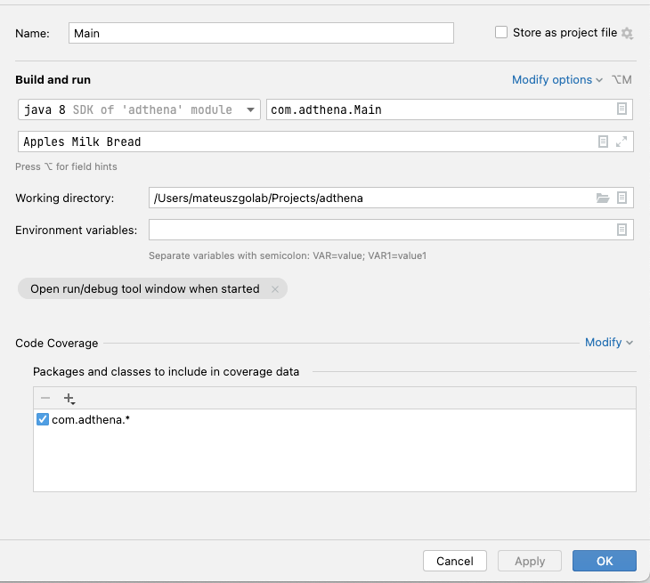

# Technical Assignment - Shopping basket

## Pre-requisites
* Java JDK 1.8
* Scala 2.13
* Maven 3

## Build

`mvn clean package`

## Run
### command line
`java -jar target/shopping-basket-1.0.jar`

example

`java -jar target/shopping-basket-1.0.jar Apples Milk Bread`

### IntelliJ

- Run -> Edit Configurations
- Add new configuration

- change 'Working directory' to your local directory
- Apply, Ok
- Run Main configuration in IntelliJ

## 